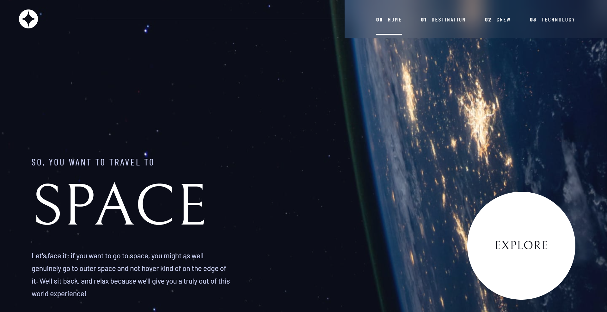

# Frontend Mentor - Space tourism website solution

This is a solution to the [Space tourism website challenge on Frontend Mentor](https://www.frontendmentor.io/challenges/space-tourism-multipage-website-gRWj1URZ3). Frontend Mentor challenges help you improve your coding skills by building realistic projects.

## Table of contents

- [Frontend Mentor - Space tourism website solution](#frontend-mentor---space-tourism-website-solution)
  - [Table of contents](#table-of-contents)
  - [Overview](#overview)
    - [The challenge](#the-challenge)
    - [Screenshot](#screenshot)
    - [Links](#links)
  - [My process](#my-process)
    - [Built with](#built-with)
    - [What I learned](#what-i-learned)
    - [Continued development](#continued-development)
  - [Author](#author)

## Overview

### The challenge

Users should be able to:

- View the optimal layout for each of the website's pages depending on their device's screen size
- See hover states for all interactive elements on the page
- View each page and be able to toggle between the tabs to see new information

### Screenshot



### Links

- Solution URL: [Frontend Mentor Solution](https://www.frontendmentor.io/solutions/respomsive-space-tourism-multi-page-website-with-framer-motion-Gf6w6V_j8G)
- Live Site URL: [Live Site](https://space-tourism-frontend-mentor-phi.vercel.app/)
- GitHub Repository: [GitHub](https://github.com/keith-ufumeli/space-tourism-frontend-mentor)

## My process

### Built with

- Semantic HTML5 markup
- CSS custom properties
- Flexbox
- CSS Grid
- Mobile-first workflow
- [React](https://reactjs.org/) - JS library
- [TypeScript](https://www.typescriptlang.org/) - Type safety
- [Vite](https://vitejs.dev/) - Build tool
- [Tailwind CSS](https://tailwindcss.com/) - CSS framework
- [Framer Motion](https://www.framer.com/motion/) - Animation library
- [GSAP](https://gsap.com/) - Animation library for complex sequences
- [React Router](https://reactrouter.com/) - Routing
- [Radix UI](https://www.radix-ui.com/) - UI primitives

### What I learned

This project was an excellent opportunity to dive deep into animation libraries and create smooth, engaging user experiences. Here are some key learnings:

**Framer Motion Integration:**
- Implemented page transitions using `AnimatePresence` for smooth route changes
- Used staggered animations for content entrance with `staggerChildren`
- Created reusable animation variants for consistent transitions across pages
- Leveraged `layoutId` for smooth active indicator transitions in navigation

```tsx
const pageVariants = {
  initial: { opacity: 0, y: 20 },
  animate: { opacity: 1, y: 0 },
  exit: { opacity: 0, y: -20 },
};
```

**GSAP for Complex Animations:**
- Used GSAP for the Explore button's hover effects with ring expansion
- Implemented smooth scale and opacity transitions that would be more complex with CSS alone
- Learned to combine GSAP with React refs for precise DOM manipulation

```tsx
gsap.to(ring, {
  scale: 1.8,
  opacity: 0.25,
  duration: 0.7,
  ease: 'power2.out',
});
```

**Tab Transitions:**
- Created smooth image and content transitions when switching between tabs
- Used `AnimatePresence` with `mode="wait"` to ensure clean transitions
- Implemented different animation directions (fade, scale, slide) for visual variety

**Responsive Design:**
- Ensured animations work smoothly across all device sizes
- Adjusted animation timings and effects for mobile vs desktop experiences
- Maintained performance while adding rich animations

### Continued development

- Explore more advanced GSAP timeline animations for complex sequences
- Experiment with scroll-triggered animations
- Add more micro-interactions throughout the UI
- Optimize animation performance for lower-end devices
- Consider adding animation preferences for users who prefer reduced motion

## Author

- GitHub - [@keith-ufumeli](https://github.com/keith-ufumeli)
- Frontend Mentor - [@keith-ufumeli](https://www.frontendmentor.io/profile/keith-ufumeli)
